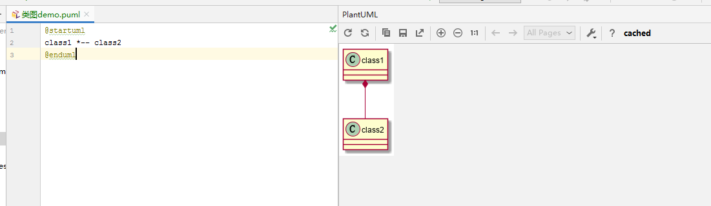

# myUml
一边学习uml语言，一边实现一些demo

## .puml文件打开插件
此处uml图是使用建模语言画的，使用idea打开项目，打开.puml文件会看到是代码文件，需要相应的插件才能运行代码查看图形。

        1、使用idea打开.puml文件
        2、未安装插件的时候，在打开的.puml文件的上方会出现有一个提示框，提示安装插件查看文件，这时候点击install安装完即可
        3、若是没有，可在setting-plugins里面搜索PlantUML integration，安装第三方插件也可
        4、重启idea，重新打开.puml文件，就会自动右边窗口会运行代码，此时点击右边窗口左上角第二个的双箭头重新运行即可查看uml图了
        
效果如下：

## 生成图片软件
编辑类图，会出现以下情况：

这种情况，需要安装 **graphviz**，可自行百度安装，网上很多教程

大致就是下载安装包，安装安装包，配置环境变量

配置完成之后重启idea即可打开类图了，效果如下：

## 时序图
    ·使用 title 来指定标题
    ·‘->’ 和 ‘–>’ 来指示线条的形式
    ·在每个时序后面加冒号 : 来添加注释
    ·使用 note 来显示备注，备注可以指定显示在左边或右边
    ·使用 == xxx == 来分隔时序图
    ·使用 … 来表示延迟省略号
    ·节点可以给自己发送消息
    
## 活动图
    ·使用 start 来表示流程开始，使用 stop 来表示流程结束
    ·顺序流程使用冒号和分号 :xxx; 来表示
    ·条件语句使用 if (“condition 1”) then (true/yes/false/no) 来表示
    ·条件语句可以嵌套
    
## 类图
    ·scale 生成图片倍数
    ·默认的，字段和方法是由PlantUML自动分组的，你也可以使用: – .. == __这些分隔符手动进行分组
    ·up、down、left、right定义线的起始方位。
    ·PlantUML用下面的符号来表示类之间的关系： 
        -泛化，Generalization：<|–
        -关联，Association：<–
        -组合，Composition：*–
        -聚合，Aggregation：o–
        -实现，Realization：<|..
        -依赖，Dependency：<..
        
## 用例图
    ·使用 actor 来定义参与者
    ·使用括号 (xxx) 来表示用例，用例用椭圆形表达
    ·使用不同的线条表达不同的关系。
    
## 组件图
    ·使用方括号 [xxx] 来表示组件
    ·可以把几个组件合并成一个包，可以使用的关键字为 package, node, folder, frame, cloud,database。不同的关键字图形不一样。
    ·在包内部用不同的箭头表达同一个包的组件之间的关系
    ·在包内部直接表达到另外一个包内部的组件的交互关系
    ·在流程图外部直接表达包之间或包的组件之间的交互关系
   

## 参考来源声明
1、相关demo代码以及描述参考：https://blog.csdn.net/zxc123e/article/details/71837923